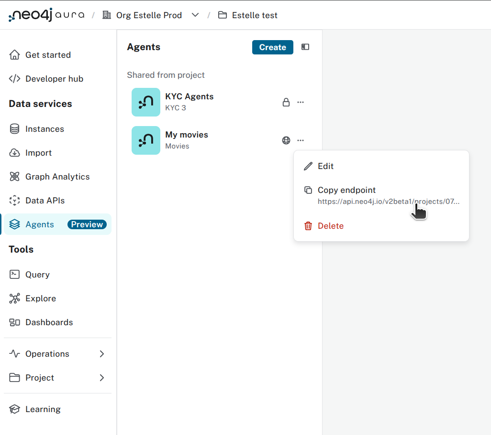

# Road to Nodes 2025: Aura Agent Workshop

This folder contains a single script `main.py` used to call a public Agent API endpoint.

To run it, you need to:

- Create an API key for the Aura API [doc](https://neo4j.com/docs/aura/classic/platform/api/authentication/) and download the credential file
- Get the Agent URL from the Aura console (see image below)
- Create a `.env` file from `.env.example` and update the parameters
- Install dependencies (e.g. `uv sync --lock`)
- Run `python main.py` and type your question

